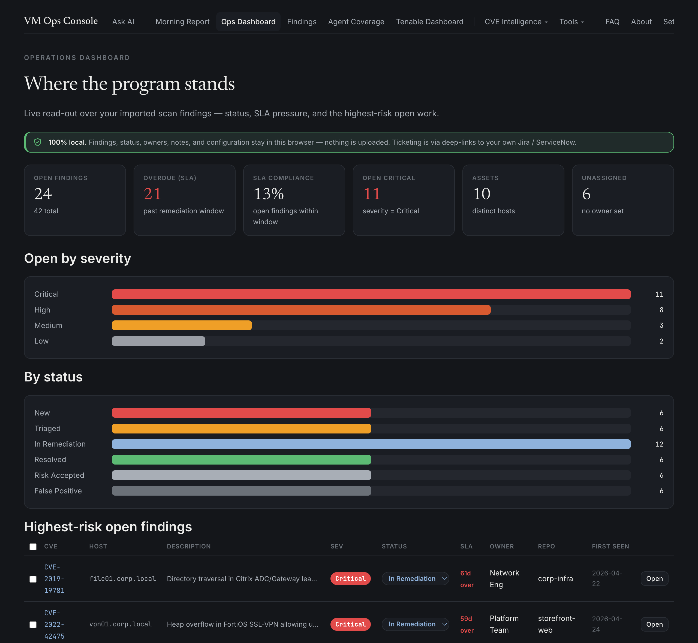

# VM Ops Console

A browser-local, backend-free **vulnerability-management operations console**. It unifies a CVE intelligence front end with three operational dashboards — a findings workbench, a Tenable vulnerability dashboard, and an AD-vs-agent coverage reconciler — under one nav, one theme, and one natural-language "Ask AI" box.

**Live:** https://cloudanimal.github.io/vm-ops-console/

The goal: track **every** vulnerability flowing from Tenable and Wiz in one place — from raw scan export to triaged, owned, ticketed, and resolved.

Everything runs in your browser. Scan exports, findings, notes, and API keys stay in `localStorage`/`IndexedDB` and are never uploaded to this site's host. Ask AI runs a small language model **entirely on-device** (Transformers.js), so your questions never leave the browser and there's no API key — the only outbound calls are to public vulnerability data sources (NVD, CISA KEV, FIRST EPSS, OSV) and a one-time Ask AI model download from a public CDN.

## What's inside

- **Ask AI** — describe what you want in plain English; a small **on-device** language model (Transformers.js, downloaded once from a public CDN) maps it to the app's *own* searches and filters (never invents CVEs), then the app runs them against real data. No API key, nothing leaves your browser.
- **Findings workbench** — import scanner findings (Tenable today; more sources on the roadmap), triage by status/owner/SLA, keep per-finding notes and a dated **status-update log**, and open Jira/ServiceNow tickets.
- **Tenable VM dashboard** — upload Tenable SC cumulative + mitigated exports for instant KPIs, severity/SLA breakdowns, top findings, and one-click report exports.
- **Agent coverage dashboard** — reconcile Active Directory against ManageEngine, Tenable, and CrowdStrike agents to find coverage gaps.
- **CVE intelligence** — search, browse, KEV/EPSS/exploit signals, statistics, and a daily Morning Report on what's newly exploitable (on Mondays it rolls up the whole weekend — everything released since Friday).
- **Software End of Life** — a built-in mirror of [endoflife.date](https://endoflife.date): browse every tracked product by category or tag, or search by name, for full release history — release/LTS/EOL/extended-support dates (in each vendor's own terms), latest version, and CPE identifiers. Sortable, per-column filterable, defaulting to the most recent EOL date. A vulnerability on EOL software is unpatchable, so it flags mitigate/replace/isolate work.

## Tech

Static single-page app, vanilla JS, hash routing, `localStorage` + `IndexedDB`. No build step. CVE data is refreshed by scheduled GitHub Actions into `data/` (requires repo secrets — see the workflows in `.github/workflows/`).

## Privacy

Open the Network tab — there are no uploads of your data. Imported scan data and findings never leave the browser. Risk signals (CVSS, EPSS, KEV, LEV, SSVC) often disagree by design; always confirm against the vendor before acting.

---

Built by [Joe Cook](https://github.com/cloudanimal).
